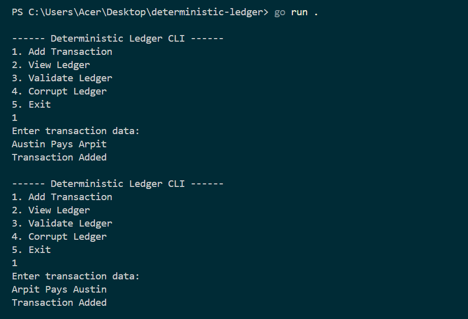
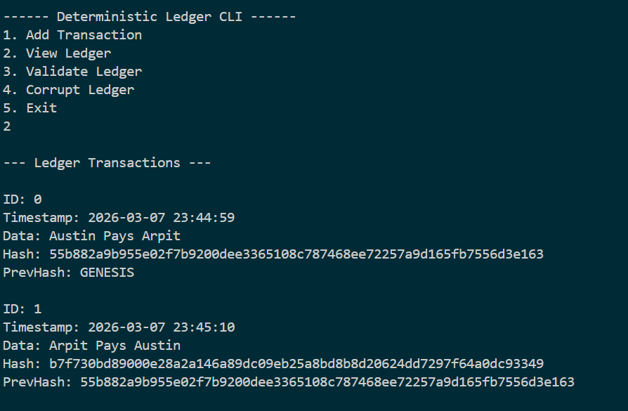

# Deterministic Ledger Implementation (Go)

## Overview

This project implements a minimal deterministic ledger system using Go.
The system records transactions and links them together using SHA256 hash chaining to preserve data integrity.

The objective of this project is to demonstrate the core principles behind blockchain systems:

- Deterministic hashing
- Hash chaining
- Tamper detection
- Ledger validation

> This implementation focuses only on ledger integrity, not networking, consensus mechanisms, or cryptocurrency logic.

---

## Ledger Structure

The ledger consists of a list of transactions. Each transaction contains specific fields that allow the system to verify integrity.

### Transaction Fields

| Field          | Description                                  |
|----------------|----------------------------------------------|
| `ID`           | Unique identifier for the transaction        |
| `Timestamp`    | Time when the transaction was created        |
| `Data`         | Transaction information entered by the user  |
| `PreviousHash` | Hash of the previous transaction             |
| `Hash`         | SHA256 hash generated from transaction data  |

### Transaction Structure (Go)

```go
type Transaction struct {
    ID           int
    Timestamp    string
    Data         string
    PreviousHash string
    Hash         string
}
```

### Ledger Structure

The ledger stores all transactions.

```go
type Ledger struct {
    Transactions []Transaction
}
```

Example structure:

```
Ledger
 ├── Transaction 0
 ├── Transaction 1
 └── Transaction 2
```

Each transaction references the previous transaction's hash.

---

## Hash Chain Purpose

The system uses a hash chain to maintain ledger integrity.

**Example:**

```
Transaction 0
  Data:     Austin Pays Arpit
  Hash:     H0
  PrevHash: GENESIS

Transaction 1
  Data:     Arpit Pays Austin
  Hash:     H1
  PrevHash: H0
```

If someone modifies Transaction 0:

```
Data: HACKED DATA
```

The recalculated hash becomes different:

```
New Hash ≠ H0
```

Since Transaction 1 still references `H0`, the chain breaks and the ledger becomes invalid.

This mechanism ensures tamper detection.

---

## Deterministic Hashing (SHA256)

The system uses the SHA256 hashing algorithm.

Each transaction hash is generated using:

```
ID + Timestamp + Data + PreviousHash
```

**Example input:**

```
ID:0
Timestamp:2026-03-07 22:02:49
Data:Austin Pays Arpit
PreviousHash:GENESIS
```

**Example output hash:**

```
599de858d72b18cacbd20ec4c26079716b1f275edc36ad91fbbade3c4504463e
```

SHA256 is deterministic, meaning:

- Same input → Same hash output
- Even a small change in input produces a completely different hash

---

## Ledger Validation Logic

The ledger validation mechanism checks two conditions.

### 1. Hash Integrity Check

The system recalculates the hash of each transaction and compares it with the stored hash.

```
RecalculatedHash == StoredHash
```

If they are different, the transaction has been modified.

### 2. Hash Chain Continuity

Each transaction must correctly reference the previous transaction's hash.

```
Current.PreviousHash == Previous.Hash
```

If this relationship is broken, the ledger becomes invalid.

---

## What the System Protects Against

This deterministic ledger protects against several types of integrity violations.

### Data Tampering

If transaction data is modified after creation, the recalculated hash will not match the stored hash.

**Example:**

```
Original Data: Austin Pays Arpit
Modified Data: HACKED DATA
```

This causes validation to fail.

### Hash Chain Manipulation

If someone attempts to alter the hash chain manually, the ledger validation process detects the inconsistency.

### Silent Data Modification

Because every transaction is hashed and linked, any hidden modification will be detected during validation.

---

## CLI Interface

The program provides a simple command-line interface.

**Menu options:**

```
1  Add Transaction
2  View Ledger
3  Validate Ledger
4  Corrupt Ledger
5  Exit
```

Users can:

- Add new transactions
- View the ledger
- Validate ledger integrity
- Simulate corruption to test tamper detection

---

## Example Terminal Output

### Adding Transactions

```

```

### Viewing Ledger

```

```

### Ledger Validation and Corruption

```

```

## Technologies Used

- **Go (Golang)**
- **SHA256** cryptographic hashing
- **Command Line Interface (CLI)**

> No external blockchain libraries were used.
